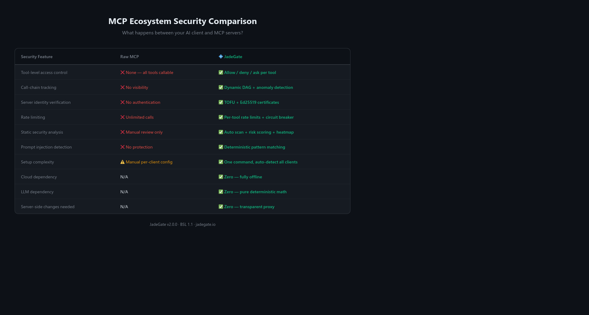
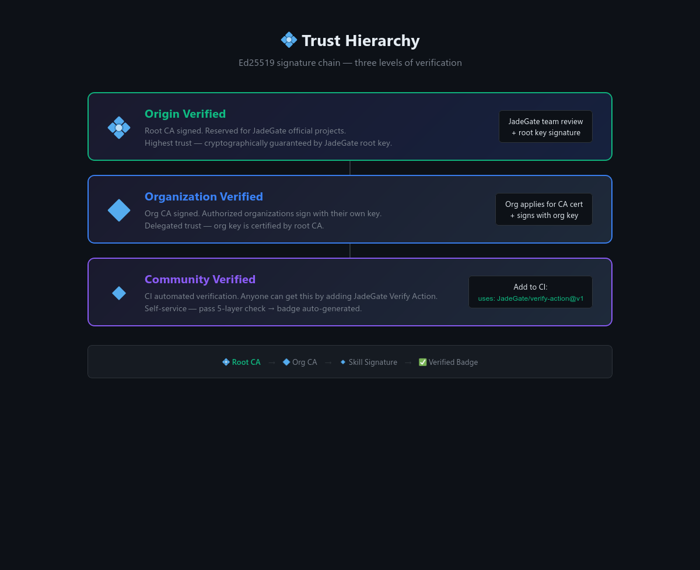

<div align="center">

# 💠 JadeGate

**Deterministic security protocol for AI agent skills.**

Zero trust. Five-layer mathematical verification. Runs locally. No cloud. No LLM. No token cost.

[](LICENSE)
[](https://python.org)
[](#)

[Website](https://jadegate.io) · [Documentation](https://jadegate.io/docs) · [Skill Registry](https://jadegate.io/registry) · [中文](#中文)

</div>

---


<div align="center">

</div>

## Why JadeGate?

AI agents are powerful. They call tools, execute skills, access APIs. But **who verifies those skills are safe?**

Current approaches rely on trust, reputation, or LLM-based review. JadeGate takes a different path:

- **Mathematical verification** — 5 deterministic layers, no probabilistic guessing
- **Runs 100% locally** — `pip install jadegate`, done. No server, no cloud, no account
- **Zero token cost** — Pure Python, zero dependencies, no LLM calls
- **Open source** — Every line of code is auditable. Security through transparency, not obscurity
- **Agent-native** — Designed for machines to query, not just humans to browse

```bash
pip install jadegate
jade verify my_skill.json
# ✅ Passed 5/5 layers | Confidence: 0.97 | 💠 Verified
```

## The Five Layers

Every skill must pass all 5 layers. No exceptions. No overrides.

<div align="center">

</div>


| Layer | Name | What it does |
|-------|------|-------------|
| 1 | **Structural Integrity** | JSON Schema validation. Malformed = rejected. |
| 2 | **Code Injection Scan** | 47 dangerous patterns (eval, exec, subprocess, shell injection...) |
| 3 | **Bayesian Confidence** | Probabilistic risk scoring based on complexity + anomaly patterns |
| 4 | **Network & Data Leak** | URL whitelist enforcement + sensitive data exfiltration detection |
| 5 | **DAG Integrity** | Execution graph must be acyclic, no orphan nodes, valid dependencies |

## For AI Agents 🤖

JadeGate is built to be queried by agents, not just humans.

```python
from jadegate import JadeValidator

# Validate before executing any skill
validator = JadeValidator()
result = validator.validate_file("skill.json")

if result.valid:
    # Safe to execute
    execute_skill(skill)
else:
    # Reject with specific reasons
    for issue in result.issues:
        print(f"[{issue.severity}] {issue.code}: {issue.message}")
```

**Agent integration patterns:**
- MCP servers can call JadeGate before loading any skill
- LangChain/LlamaIndex tool loaders can validate on import
- Any framework — JadeGate is framework-agnostic

**Machine-readable output:**
```json
{
  "valid": true,
  "skill_hash": "sha256:7db927bf...",
  "issues": [],
  "checked_at": 1771669175.92
}
```


<div align="center">

</div>

## Cryptographic Trust Chain

Skills can be signed by verified publishers using Ed25519 signatures.

```
Root CA (JadeGate) → Org CA (e.g., Alibaba Cloud) → Skill Signature
```

- **Root key** held offline by project maintainer
- **Org keys** issued to verified organizations
- **Anyone can verify** — public keys are in this repo
- **Key rotation** supported via signed rotation declarations

```bash
jade verify --check-signature skill.json
# ✅ Signature valid | Signer: Alibaba Cloud (org) | Expires: 2027-02-21
```

## Red Team Tested

We run adversarial attacks against our own engine. Current results:

| Attack Type | Status |
|------------|--------|
| Unicode homoglyph bypass | ✅ Blocked |
| Base64 encoded payloads | ✅ Blocked |
| Template injection | ✅ Blocked |
| Split command across fields | ✅ Blocked |
| DAG cycle attack | ✅ Blocked |
| Subdomain whitelist spoof | ✅ Blocked |
| Data exfiltration via URL | ✅ Blocked |
| eval/exec obfuscation | ✅ Blocked |
| curl pipe bash | ✅ Blocked |
| Reverse shell (netcat) | ✅ Blocked |
| Env variable exfiltration | ✅ Blocked |
| subprocess injection | ✅ Blocked |

**12/12 attacks blocked.** Full report available in our security audits.

## Quick Start

```bash
# Install (zero dependencies)
pip install jadegate

# Verify a skill
jade verify skill.json

# Verify all skills in a directory
jade verify ./skills/

# Check signature
jade verify --check-signature skill.json

# Batch verify with JSON output (for CI/CD)
jade verify ./skills/ --format json
```

## Skill Format

```json
{
  "jade_version": "1.0.0",
  "skill_id": "brave_web_search",
  "metadata": {
    "name": "Brave Web Search",
    "version": "1.0.0",
    "description": "Search the web via Brave Search API",
    "author": "jadegate-official",
    "tags": ["search", "web", "mcp"]
  },
  "trigger": { "type": "mcp_call", "conditions": {} },
  "input_schema": {
    "required_params": [
      { "name": "query", "type": "string", "description": "Search query" }
    ]
  },
  "output_schema": {
    "fields": [
      { "name": "results", "type": "array", "description": "Search results" }
    ]
  },
  "execution_dag": {
    "nodes": [{ "id": "search", "type": "mcp_call", "params": {...} }],
    "edges": [],
    "entry_node": "search",
    "exit_node": "search"
  },
  "security": {
    "network_whitelist": ["api.search.brave.com"],
    "sandbox_level": "standard",
    "max_execution_time_ms": 10000
  }
}
```

## Hosting & Security

- **GitHub Pages** for the website — DDoS protection by GitHub's CDN
- **GitHub** for code hosting — tamper-proof with signed commits
- **No backend servers** — nothing to hack, nothing to DDoS
- **No user data collected** — ever

## Contributing

We welcome contributions! See [CONTRIBUTING.md](CONTRIBUTING.md) for guidelines.

- 🐛 Found a vulnerability? Open a security advisory (not a public issue)
- 💡 New detection pattern? Submit a PR with test cases
- 📦 New skill? Follow the skill format and run `jade verify` before submitting

## License

Apache 2.0 — Use it, modify it, ship it. Just keep the attribution.

---

<div align="center">

## 中文

**JadeGate — AI 技能的确定性安全协议**

零信任。五层数学验证。本地运行。无需云端。无需 LLM。零 token 消耗。

### 为什么选择 JadeGate？

- 🔒 **完全开源** — 每一行代码都可审计
- 💻 **本地运行** — `pip install jadegate`，不连任何服务器
- 🧮 **数学验证** — 5 层确定性检测，不靠概率猜测
- 🤖 **Agent 原生** — 为 AI agent 设计的查询接口
- 💰 **零成本** — 纯 Python，零依赖，不调用任何 LLM
- 🛡️ **红队测试** — 12 种攻击手法全部拦截

### 核心理念

JadeGate 不需要你的算力，不收集你的数据，不需要你注册账号。

它是一个纯数学的安全协议——像 HTTPS 保护网页一样，JadeGate 保护 AI 技能。

下载到本地，验证你的技能，就这么简单。

</div>
