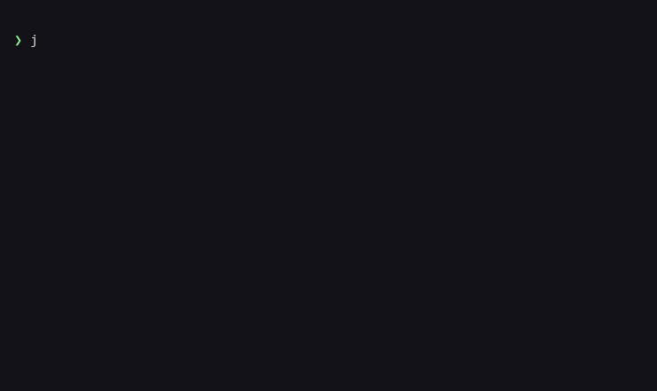
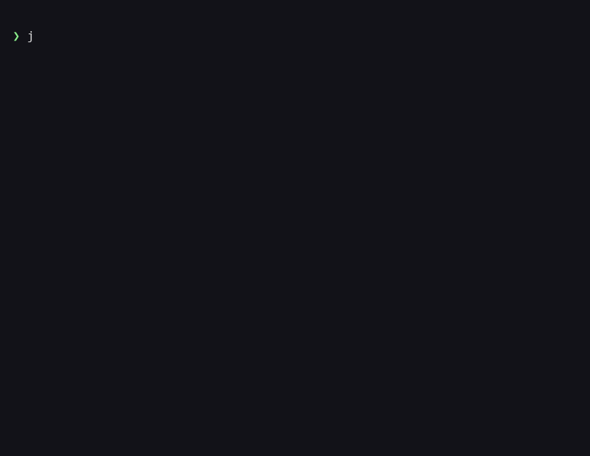

# JadeGate 💠

<div align="center">

[English](README.md) · [中文](README_CN.md) · [Website](https://jadegate.io) · [Get Verified →](https://jadegate.io/guide/)

</div>

**The TLS of AI Tool Calls.**

One command. Every MCP server protected. Zero config.

```bash
pip install jadegate
# That's it. All your MCP servers are now protected.
```

---

## The Problem

MCP has no security layer. Any tool can read your files, make network requests, or execute commands — and your AI client will happily comply.

There are 10,000+ MCP servers on GitHub. Most have never been audited. Security researchers have demonstrated tools that silently access `~/.ssh/`, `.env` files, and browser cookies while claiming to do something harmless.

MCP is TCP without TLS. JadeGate adds the TLS.

## How It Works

JadeGate sits between your AI client and MCP servers as a transparent proxy. Every tool call passes through 6 security layers before execution:

```
AI Client (Claude, Cursor, etc.)
    ↓
  JadeGate Proxy          ← policy check, anomaly detection, trust verification
    ↓
  MCP Server (filesystem, github, puppeteer, etc.)
```

### The 6 Layers

| Layer | What it does |
|-------|-------------|
| **Policy** | Allowlist/blocklist rules per tool, rate limiting, argument validation |
| **Runtime** | Dynamic call-chain tracking (DAG), anomaly detection, circuit breaker |
| **Transport** | Transparent MCP proxy — intercepts stdio/SSE without modifying the server |
| **Trust** | TOFU (Trust On First Use) + Ed25519 certificates for server identity |
| **Scanner** | Static analysis of MCP server capabilities, risk scoring |
| **Installer** | Auto-injects into all MCP client configs (Claude, Cursor, Windsurf, Cline, Continue, Zed) |

## Install

```bash
pip install jadegate
```

That's it. On install, JadeGate automatically:
1. Scans your system for MCP client configurations
2. Wraps each MCP server with the JadeGate proxy
3. Backs up original configs (fully reversible)

Next time you open Claude Desktop, Cursor, or any supported client — protection is active.

### Uninstall

```bash
jadegate uninstall   # Restores all original configs
pip uninstall jadegate
```

## Demo

### Security Audit Report


### Protection Status


### Certificate Management


### Policy


---

## Commands

```bash
jadegate status      # Check what's protected
jadegate scan        # Security audit all MCP servers
jadegate install     # Re-run auto-injection (after adding new MCP servers)
jadegate uninstall   # Revert all changes
```

### Scan Output

```
$ jadegate scan

  💠 JadeGate Security Audit Report
  ━━━━━━━━━━━━━━━━━━━━━━━━━━━━━━━━━━━━━━━━━━━━━━━━━━━━━━━━━━━━━━

  Server: puppeteer  [CRITICAL]
  Command: npx @modelcontextprotocol/server-puppeteer

    FINDINGS (2)
    ──────────────────────────────────────────────────────────

    [F-001] ⚫ CRITICAL · Arbitrary code / shell execution
      Tool can execute shell commands or spawn processes.
      → Action: BLOCK

    [F-003] 🔴 HIGH · Browser automation (JS execution + DOM access)
      Cookie theft, session hijacking, 2FA code capture via screenshot.
      → Action: ASK on every call

  SUMMARY
  3 server(s) scanned · 0 low  1 medium  1 high  1 critical
  5 finding(s) total  · 1 critical  2 high

  ⚠  3 critical/high finding(s) require immediate action.
```

## Python SDK Protection

For Python agents using OpenAI or Anthropic SDKs directly:

```bash
export JADEGATE=1
python my_agent.py
# All SDK tool calls are now intercepted and protected
```

Or in code:

```python
import jadegate
jadegate.activate()

# Now use OpenAI/Anthropic as normal — JadeGate intercepts tool calls
from openai import OpenAI
client = OpenAI()
```

## Policy Configuration

Default policy blocks dangerous patterns. Customize per tool:

```json
{
  "default_action": "allow",
  "tool_rules": {
    "filesystem:write_file": {
      "action": "ask",
      "reason": "File write requires confirmation"
    },
    "shell:exec": {
      "action": "deny",
      "reason": "Shell execution blocked by policy"
    }
  },
  "rate_limit": {
    "max_calls_per_minute": 60
  }
}
```

## Architecture

```
jadegate/
├── policy/          # Allowlist/blocklist rules, rate limiting
├── runtime/         # DAG tracking, circuit breaker, anomaly detection
├── transport/       # MCP proxy (stdio/SSE), SDK hooks
├── trust/           # TOFU, Ed25519 certificates, trust store
├── scanner/         # Static analysis, risk scoring
├── installer.py     # Auto-inject into MCP client configs
├── cli.py           # Command-line interface
└── post_install.py  # pip install auto-activation
```

## Supported Clients

| Client | Config Path | Auto-detected |
|--------|-----------|:---:|
| Claude Desktop | `~/.config/claude/` | ✅ |
| Cursor | `~/.cursor/` | ✅ |
| Windsurf | `~/.codeium/windsurf/` | ✅ |
| Cline | `~/.vscode/cline/` | ✅ |
| Continue | `~/.continue/` | ✅ |
| Zed | `~/.config/zed/` | ✅ |
| Custom | `jadegate install --config <path>` | ➕ |

## Design Principles

- **Zero config**: `pip install` = protected. No setup, no env vars, no config files.
- **Transparent**: MCP servers don't know JadeGate exists. No server-side changes needed.
- **Reversible**: `jadegate uninstall` restores everything. Clean removal guaranteed.
- **Offline**: All analysis runs locally. No telemetry, no cloud, no data leaves your machine.
- **Fail-open safe**: If JadeGate crashes, your MCP servers still work (graceful degradation).

## Running Tests

```bash
pip install pytest
pytest tests/ -v
# 238 tests, all passing
```

## Comparison

| | Raw MCP | JadeGate |
|---|---|---|
| Tool call policy | ❌ None | ✅ Per-tool allow/deny/ask |
| Call chain tracking | ❌ None | ✅ Dynamic DAG |
| Anomaly detection | ❌ None | ✅ Circuit breaker + rate limit |
| Server identity | ❌ None | ✅ TOFU + Ed25519 |
| Security scan | ❌ None | ✅ Static analysis + risk score |
| Setup effort | N/A | `pip install jadegate` |

## License

BSL 1.1 — Converts to Apache 2.0 in 4 years

---

**GitHub**: https://github.com/JadeGate/jadegate  
**PyPI**: https://pypi.org/project/jadegate/  
**Website**: https://jadegate.io
