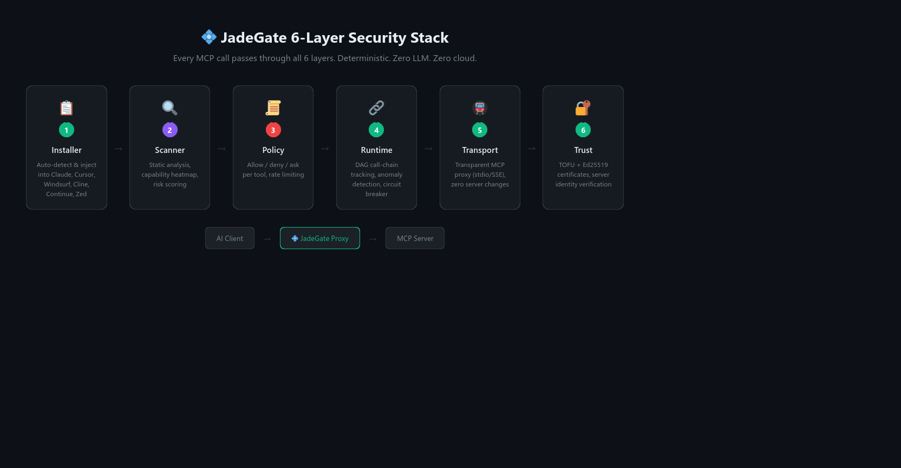

# JadeGate 💠

**AI 工具调用的 TLS。**

[](https://pypi.org/project/jadegate/)
[](#测试)
[](LICENSE)
[](https://jadegate.io)

一条命令，保护所有 MCP Server，零配置。

```bash
pip install jadegate
```

<p align="center">
  
</p>

---

## 为什么需要 JadeGate？

MCP 没有安全层。任何工具都能读你的文件、发网络请求、执行命令——而你的 AI 客户端会毫不犹豫地执行。

GitHub 上有 10,000+ 个 MCP Server，绝大多数从未被审计过。安全研究者已经证实：有些工具会在你不知情的情况下访问 `~/.ssh/`、`.env` 文件和浏览器 cookies。

MCP 是没有 TLS 的 TCP。**JadeGate 就是那个 TLS。**

- 🔒 **零配置** — `pip install` = 已保护
- 🔍 **6 层安全栈** — 策略、运行时、传输、信任、扫描、安装
- 🚫 **零云端** — 一切本地运行，无遥测
- 🧮 **零 LLM** — 纯确定性验证，零 token 消耗
- ↩️ **完全可逆** — `jadegate uninstall` 恢复一切

## 工作原理

JadeGate 作为透明代理，插在 AI 客户端和 MCP Server 之间：

```
AI 客户端（Claude、Cursor 等）
    ↓
  💠 JadeGate 代理        ← 6 层安全检查
    ↓
  MCP Server（filesystem、github、puppeteer 等）
```

<p align="center">
  
</p>

### 6 层安全栈

| 层 | 功能 |
|---|------|
| **安装层** | 自动注入 Claude、Cursor、Windsurf、Cline、Continue、Zed 配置 |
| **扫描层** | MCP Server 能力静态分析，风险评分，能力热力图 |
| **策略层** | 按工具配置允许/拒绝/询问规则，速率限制，参数校验 |
| **运行时层** | 动态调用链追踪（DAG），异常检测，熔断器 |
| **传输层** | 透明 MCP 代理——拦截 stdio/SSE，不修改 Server |
| **信任层** | TOFU + Ed25519 证书验证 Server 身份 |

## 快速开始

### 1. 安装

```bash
pip install jadegate
```

安装完成的瞬间，JadeGate 自动：
1. 扫描系统上所有 MCP 客户端配置
2. 给每个 MCP Server 套上 JadeGate 代理
3. 备份原始配置（完全可逆）

下次打开 Claude Desktop、Cursor 或任何支持的客户端——保护已生效。

### 2. 查看状态

```bash
jadegate status
```

### 3. 扫描你的 MCP Server

```bash
jadegate scan
```

输出：
```
💠 JadeGate v2.0.0 — AI Tool Call Security Protocol

MCP Server Security Scan

✓ filesystem  ● MEDIUM    filesystem access
  tools: 3 discovered
✓ github      ● MEDIUM    network access
  tools: 5 discovered
✓ puppeteer   ● CRITICAL  shell + network + browser
  tools: 8 discovered

3 servers scanned: 0 low, 2 medium, 0 high, 1 critical
All servers protected by JadeGate proxy.
```

### 4. 卸载

```bash
jadegate uninstall   # 恢复所有原始配置
pip uninstall jadegate
```

## Python SDK 保护

如果你的 Python Agent 直接使用 OpenAI 或 Anthropic SDK：

```python
import jadegate
jadegate.activate()

# 正常使用 OpenAI/Anthropic——JadeGate 自动拦截工具调用
from openai import OpenAI
client = OpenAI()
```

或通过环境变量：

```bash
export JADEGATE=1
python my_agent.py
```

## 信任层级

JadeGate 使用 Ed25519 签名链，三级信任体系：

<p align="center">
  
</p>

| 徽章 | 级别 | 获取方式 |
|------|------|---------|
| 💠 Origin | Root CA 签名 | JadeGate 团队审核 |
| 🔷 Organization | 组织 CA 签名 | 申请组织证书 |
| 🔹 Community | CI 自动验证 | 在 CI 中添加 `JadeGate/verify-action@v1` |

### 给你的 MCP Server 加上验证徽章

```yaml
# .github/workflows/jadegate.yml
name: JadeGate Verify
on: [push, pull_request]
jobs:
  verify:
    runs-on: ubuntu-latest
    steps:
      - uses: actions/checkout@v4
      - uses: JadeGate/verify-action@v1
```

通过全部 5 项检查 → 自动获得 🔹 Community Verified 徽章。

## 策略配置

默认策略拦截危险模式。可按工具自定义：

```json
{
  "default_action": "allow",
  "tool_rules": {
    "filesystem:write_file": {
      "action": "ask",
      "reason": "文件写入需要确认"
    },
    "shell:exec": {
      "action": "deny",
      "reason": "Shell 执行被策略拦截"
    }
  },
  "rate_limit": {
    "max_calls_per_minute": 60
  }
}
```

## 支持的客户端

| 客户端 | 自动检测 |
|--------|:---:|
| Claude Desktop | ✅ |
| Cursor | ✅ |
| Windsurf | ✅ |
| Cline (VS Code) | ✅ |
| Continue | ✅ |
| Zed | ✅ |
| 自定义 | `jadegate install --config <path>` |

## 对比

<p align="center">
  
</p>

## 测试

```bash
pip install pytest
pytest tests/ -v
# 238 个测试，全部通过
```

## 设计原则

- **零配置**：`pip install` = 已保护。不需要设置、环境变量、配置文件。
- **透明**：MCP Server 不知道 JadeGate 的存在。不需要修改 Server。
- **可逆**：`jadegate uninstall` 恢复一切。干净卸载。
- **离线**：所有分析在本地运行。无遥测、无云端、数据不出机器。
- **确定性**：纯数学验证。无 LLM 调用、无启发式、无误报。
- **安全降级**：JadeGate 崩溃不影响 MCP Server 正常工作。

## 许可证

[BSL 1.1](LICENSE) — 2030-02-01 自动转为 Apache 2.0。

转换日期前，非生产用途免费，生产用途需商业许可。

---

💠 **[jadegate.io](https://jadegate.io)** · [GitHub](https://github.com/JadeGate/jadegate) · [PyPI](https://pypi.org/project/jadegate/) · [Discord](https://discord.gg/clawd)
